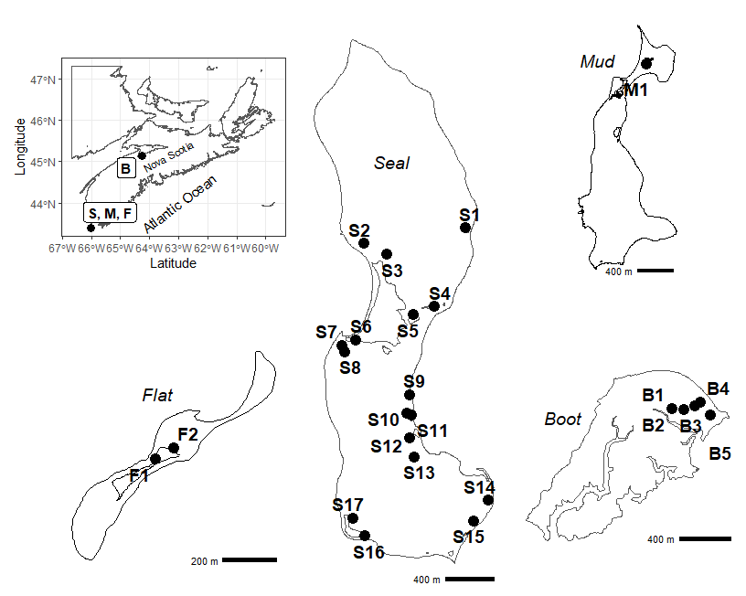
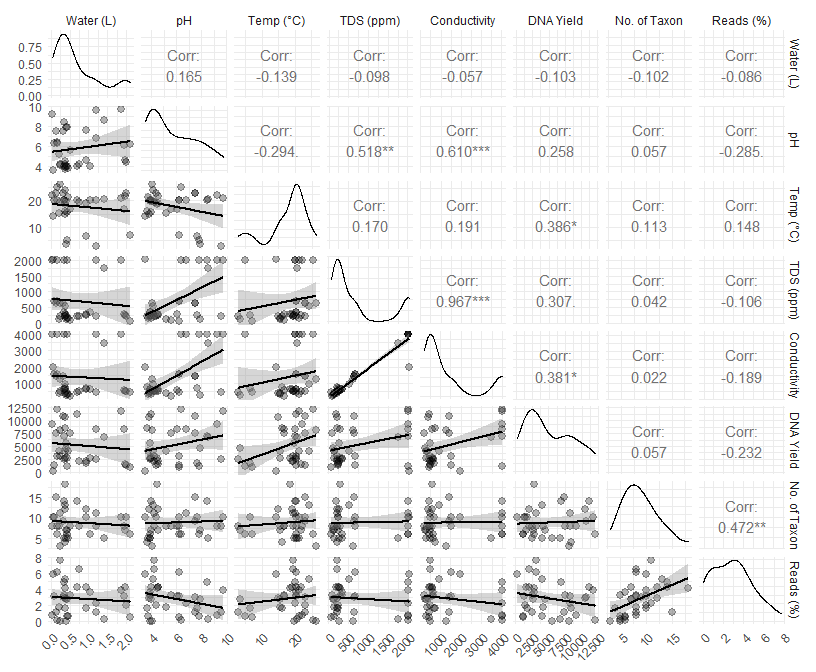
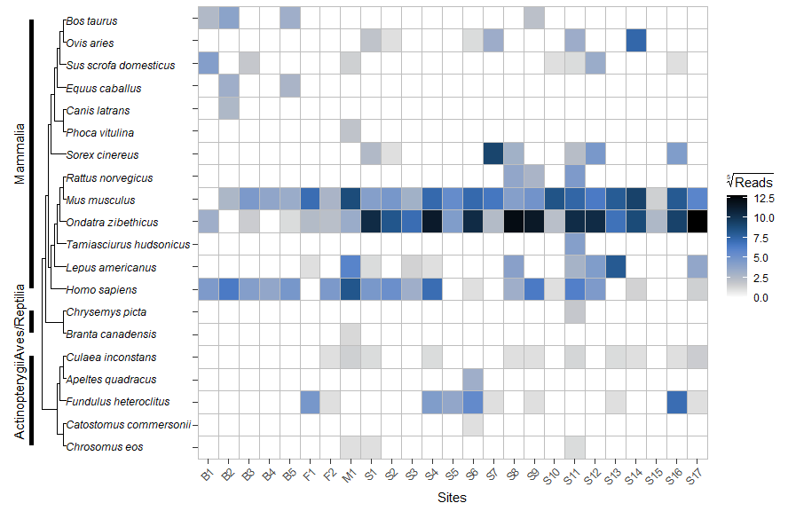

The use of eDNA to assess remote coastal islands for the presence of
invasive terrestrial mammals
================
DH
2022-04-14

**Abstract**–Coastal islands face grave threats such as sea level rise,
development, and biological invasions. Yet, in many areas, basic
knowledge of the prevalence of island dwelling species and the pressures
that limit their persistence is often lacking. Biological inventories
can help fill these knowledge gaps and inform conversation actions, but
are hindered by the logistics and costs of conducting offshore or
nearshore fieldwork. In light of the need for environmental
practitioners to be able to survey islands robustly and efficiently, we
test off-the-shelf commercial environmental DNA water samplers and
commercial metabarcoding lab services as ways to enable rapid
inventories of coastal islands for mammalian biodiversity and invasive
terrestrial threats…

## Introduction

Using environmental DNA to detect the presence of terrestrial, aquatic,
or semi-aquatic organisms has been well established over the past decade
and a half (Ficetola, Miaud, Pompanon, & Taberlet, 2008; Harper et al.,
2019; Leempoel, Hebert, & Hadly, 2020; Lyet et al., 2021; Neice & McRae,
2021; Saenz-Agudelo et al., 2022; Sales et al., 2020). More recently,
there has been a massive increase in studies, by experts and non-experts
alike, that tout the potential of eDNA to transform conservation
projects through biodiversity monitoring. Indeed, eDNA methods appear to
offer conservation practitioners–who are often work within a
crisis-driven field and are faced with severe time and resource
constraints when it comes to acquiring ecological data–a revolutionary
tool; too often there is a lack of data and evidence underpinning
environmental management. But as citizen scientists, communities, and
practitioners from various backgrounds begin to foray into eDNA methods
(Biggs et al., 2015; Loeza-Quintana et al., 2021; Thomsen & Willerslev,
2015; Yang et al., 2021), it remains to be seen exactly how, where, and
when, this new tool can be utilized to inform long term conservation
management…and how results compare to traditional, direct, methods of
sampling mammals, via infrared cameras, hair tunnels, cage and snap
trapping, some of which require intensive training, frequency checking,
and extra levels of approvals and permitting.

We sampled environmental DNA, extracted from water, to assess
terrestrial mammalian threats and a “biodiversity bonus,” on coastal
islands situated in a logistically challenging, ecologically threatened,
maritime landscape. Our study sites fall within an archipelago in the
province of Nova Scotia, Canada, which consists of some 4000 islands and
skerries, many of which are threatened by rising sea levels, biological
invasions, and human development. Such coastal landscapes in Atlantic
Canada have long relied on de facto conservation, due to in part to the
remoteness of islands. As conservation organizations and governments
move to prioritize the securement of new island landholdings, and boost
legal protection of existing island holdings, there is increased need
for rapid, cost-efficient assessment of island biodiversity and threats.
Thus, our objective is to test the use of eDNA as a tool to provide such
assessments, from the perspective of environmental practitioners in need
of system that combines ease-of-use, robustness, and quality assurance.
Specifically, we aimed to assess the diversity of problematic native and
invasive terrestrial mammals on islands, as a necessary first step of
implementation of a science-based conservation management and
decision-making, by providing detailed, on-the-ground assessments of
species and their threats (cite CS or others?).

We had many questions from the onset. How robust would the process be,
in practice? To what degree would the volume of the water sampled, or
the qualities of the substrate, hydrologic conditions, or seaonality,
effect results? Should we avoid turbid, highly acidic (citation?),
brackish water when trtying to detect mammals?

Other potetnial applications? Some studies show a correlation between
the eDNA concentration and abundance (Everts et al., 2021)

As conservation actions are largely based on the best available
fine-scale knowledge about species distributions and their threats, we
aim to: 1) conduct holistic inventories of problematic mammal species in
a key coastal islands that haven not been recently evaluated, and 2)
find ways to improve monitoring of wildlife and their threats by
deploying new detection methods for invasive and problematic species
through use of eDNA methods. Our studies will help assess the ecological
value of the region, and inform decision makers involved in the transfer
of lands for inclusion within the protected areas network known as the
Atlantic Canada Archipelago.

Discussion–we believe knowledge generated from eDNA may help identify
and develop threat mitigation strategies and inform any future whole
island restoration efforts.

## Methods

We collected water samples from 35 sites on four islands (Seal, Mud,
Flat, and Boot) in Nova Scotia, Canada, during the fall of 2021. we
collected 30 water samples for eDNA analysis (nsamples in parentheses),
across Mud Island (2), Flat Island (2), Boot Island (5), and Seal Island
(26). We filtered distilled water in the same manner as the other field
samples, as a negative control. All samples were collected using a
Smith-Root backpack sampler and self-preserving 1.2 micron filters.
Samples were submitted to Precision Biomonitoring for analysis. Lab
analysis will employ MiMammal universal primers, primers that have
previously been shown to detect North American mammal species. We used
self-preserving filters made of polyethersulfone membranes with a pore
size of 1.2 µm, and all measurements of environmental correlates were
made with a Hanna HI98129 Combo pH/Conductivity/TDS tester.

## Results

A pairwise plot (**schloerke\_ggally\_2021?**) reveals the structure
between environment correlates (e.g., pH), sampling parameters (e.g.,
volume of water filtered), and results from the labratory analysis, such
as DNA yield (ng/ml),

of taxa detected (No. of Taxon), and the proportion of reads (“% reads”)
for each sample station. The volume of water filtered, and DNA yield,
showed little correlation where one might expect a positive one; the
lack of correlation may be due in part to the accumulation of eDNA in
small turbid pools, where filters, clogging quickly by debris (keeping
sample volumes relatively low), where still able to capture eDNA.
Freshwater was scarce across the extent of the islands visited, and
turbid streams and pools likely served as important sources of fresh
water for mammals. The negative correlation between proportion of reads
among samples (“% reads”) and DNA yield suggests that samples with high
yields contained greater amounts of non-targeted DNA, while observed
positive association between reads and richness may be expected \[Bálint
et al. (2016)).Positive correlations between total dissolved solids and
conductivity are consistent with correlations described by others
(Collins, M. K., Spear, Stephen F., Groves, John D., Williams, Lori A.,
& Kuchta, Shawn R., 2019).

To date, reads (i.e., sequences of base pairs that correspond to part of
a DNA fragment) that correspond with 45 taxon have been detected from
the 35 water samples (collected from islands Mud, Flat, Seal, and Boot).

A generalized pairs plot using sampling substrate, ie.e., brackish water
(green) and freshwater (orange), to explore structure in the data set.
Freshwater produced more reads despite lower DNA yields, suggesting
freshwater samples contained more targeted (mammalian) eDNA…

The number of point occurrences of taxa detected at sample stations (n
in parertheses) on Flat (2), Mud (2), and Seal Island (26). House mouse
(Mus musculus) and Muskat (Ondatra zibethicus) were detected at all
stations, while detections at the rank of Muroidea or lower (i.e.,
Murinae, Cricetidae) most likely represent brown rat (Rattus
norvegicus), house mouse, or muskrat, but could include those of other
rodents not yet detected on these islands. The subfamily Soricinae, and
genus Sorex, likely represent Sorex cinereus, described as the only
native small mammal on Seal Island (Stewart and Baker 1992). There were
no detections of soricids at sample stations on Mud or Flat Island.
Defections of human DNA in samples are not included, nor are any
occurrences detected from the field blank.

Occurrence of taxa in water samples (n = 10) taken from the same
location (n = 5), but collected before and after heavy rains. I could
collapse some taxa (e.g., Soricinae and Soricidae likely represent Sorex
cinereus, or masked shrew) to improve the visual. Note that our only
detections of brown rat and red squirrel within study extent (nsites =
30) were from those samples collected immediately after a rainfall, and
consistent with the suggestion of Lyet et al. (2021) to collect eDNA
water samples \[from catchments\] following heavy rain to improve
detection rates and hence increase survey efficiency. I think I could
rework this figure to better reflect detections, overall, in relation to
these “paired” sites. For example, Lepus americanus was detected at
other “nonpaired” sites (and before the rain), but was only detected at
“after rain” sites within the 5 paired sites (if that makes sense).

Another look at the same subset of data shown in Figure 4 (i.e., 10
samples from 5 sites, where we collected before and after rainfall). ,
Note the increase in number of taxa detected in samples collected after
the heavy rainfall. The 11 most common species detected in water samples
(n = 30) as determined by MiMammal (12S) single locus metabarcoding
analysis. The plot is broken down by species (common names), and where
possible, detections of taxa at ranks greater than species were
aggreagated into their respective group (e.g., reads of Lagomorpha
collasped into detections of Lepus americanus). Samples are grouped by
island (Seal, Mud, Flat). Empty space represents reads not identified at
the corresponding taxonomic rank. Taxa representing less than 0.05% of
reads per sample, on average, were filtered to improve the visual.

                                                            

## Discussion

## Acknowledgements

We thank Jay Cashubec at Nature Metrics for providing lab services and
technical advice.

## Literature Cited

Bálint, M., Bahram, M., Eren, A. M., Faust, K., Fuhrman, J. A., Lindahl,
B., … Tedersoo, L. (2016). Millions of reads, thousands of taxa:
Microbial community structure and associations analyzed via marker
genes. *FEMS Microbiology Reviews*, *40*(5), 686–700. doi:
[10.1093/femsre/fuw017](https://doi.org/10.1093/femsre/fuw017)

Biggs, J., Ewald, N., Valentini, A., Gaboriaud, C., Dejean, T.,
Griffiths, R. A., … Dunn, F. (2015). Using eDNA to develop a national citizen science-based
monitoring programme for the great crested newt (Triturus cristatus).
*Special Issue: Environmental DNA: A Powerful New Tool for Biological
Conservation*, *183*, 19–28. doi:
[10.1016/j.biocon.2014.11.029](https://doi.org/10.1016/j.biocon.2014.11.029)

Collins, M. K., Spear, Stephen F., Groves, John D., Williams, Lori A., &
Kuchta, Shawn R. (2019). Searching for a Salamander: Distribution and
Habitat of the Mudpuppy (Necturus maculosus) in Southeast Ohio Using
eDNA as a Rapid Assessment Technique. *The
American Midland Naturalist*, *182*(2), 191–202. doi:
[10.1674/0003-0031-182.2.191](https://doi.org/10.1674/0003-0031-182.2.191)

Everts, T., Halfmaerten, D., Neyrinck, S., De Regge, N., Jacquemyn, H.,
& Brys, R. (2021). Accurate detection and quantification of seasonal
abundance of American bullfrog (Lithobates catesbeianus) using ddPCR eDNA assays.
*Scientific Reports*, *11*(1), 11282. doi:
[10.1038/s41598-021-90771-w](https://doi.org/10.1038/s41598-021-90771-w)

Ficetola, G. F., Miaud, C., Pompanon, F., & Taberlet, P. (2008). Species
detection using environmental DNA from water samples. *Biology Letters*,
*4*(4), 423–425. doi:
[10.1098/rsbl.2008.0118](https://doi.org/10.1098/rsbl.2008.0118)

Harper, L. R., Lawson Handley, L., Carpenter, A. I., Ghazali, M., Di
Muri, C., Macgregor, C. J., … Hänfling, B. (2019). Environmental DNA
(eDNA) metabarcoding of pond water as a tool
to survey conservation and management priority mammals. *Biological
Conservation*, *238*, 108225. doi:
[10.1016/j.biocon.2019.108225](https://doi.org/10.1016/j.biocon.2019.108225)

Leempoel, K., Hebert, T., & Hadly, E. A. (2020). A comparison of eDNA to camera trapping for assessment of
terrestrial mammal diversity. *Proceedings of the Royal Society B:
Biological Sciences*, *287*(1918), 20192353. doi:
[10.1098/rspb.2019.2353](https://doi.org/10.1098/rspb.2019.2353)

Loeza-Quintana, T., Crookes, S., Li, P. Y., Reid, D. P., Smith, M., &
Hanner, R. H. (2021). Environmental DNA detection of endangered and
invasive species in Kejimkujik National Park and Historic Site.
*Genome*, *64*(3), 172–180. doi:
[10.1139/gen-2020-0042](https://doi.org/10.1139/gen-2020-0042)

Lyet, A., Pellissier, L., Valentini, A., Dejean, T., Hehmeyer, A., &
Naidoo, R. (2021). eDNA sampled from stream
networks correlates with camera trap detection rates of terrestrial
mammals. *Scientific Reports*, *11*(1), 11362. doi:
[10.1038/s41598-021-90598-5](https://doi.org/10.1038/s41598-021-90598-5)

Neice, A. A., & McRae, S. B. (2021). An eDNA
diagnostic test to detect a rare, secretive marsh bird. *Global Ecology
and Conservation*, e01529. doi:
[10.1016/j.gecco.2021.e01529](https://doi.org/10.1016/j.gecco.2021.e01529)

Saenz-Agudelo, P., Delrieu-Trottin, E., DiBattista, J. D.,
Martínez-Rincon, D., Morales-González, S., Pontigo, F., … Correa, C.
(2022). Monitoring vertebrate biodiversity of a protected coastal
wetland using eDNA metabarcoding.
*Environmental DNA*, *4*(1), 77–92. doi:
[10.1002/edn3.200](https://doi.org/10.1002/edn3.200)

Sales, N. G., McKenzie, M. B., Drake, J., Harper, L. R., Browett, S. S.,
Coscia, I., … McDevitt, A. D. (2020). Fishing for mammals:
Landscape-level monitoring of terrestrial and semi-aquatic communities
using eDNA from riverine systems. *Journal
of Applied Ecology*, *57*(4), 707–716. doi:
[10.1111/1365-2664.13592](https://doi.org/10.1111/1365-2664.13592)

Thomsen, P. F., & Willerslev, E. (2015). Environmental DNA – An emerging
tool in conservation for monitoring past and present biodiversity.
*Special Issue: Environmental DNA: A Powerful New Tool for Biological
Conservation*, *183*, 4–18. doi:
[10.1016/j.biocon.2014.11.019](https://doi.org/10.1016/j.biocon.2014.11.019)

Yang, J., Zhang, X., Jin, X., Seymour, M., Richter, C., Logares, R., …
Klymus, K. (2021). Recent advances in environmental DNA-based
biodiversity assessment and conservation. *Diversity and Distributions*,
*27*(10), 1876–1879. Retrieved from
<https://www.jstor.org/stable/48621925>

